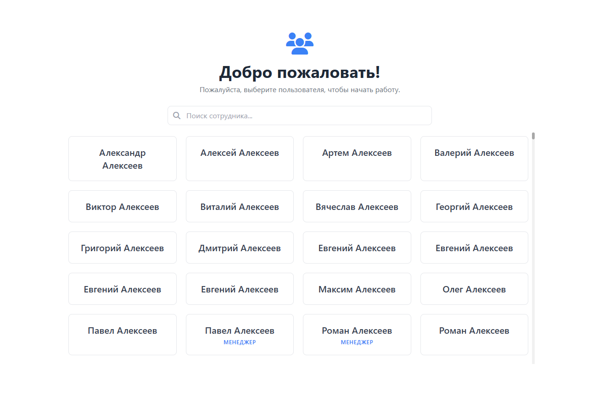
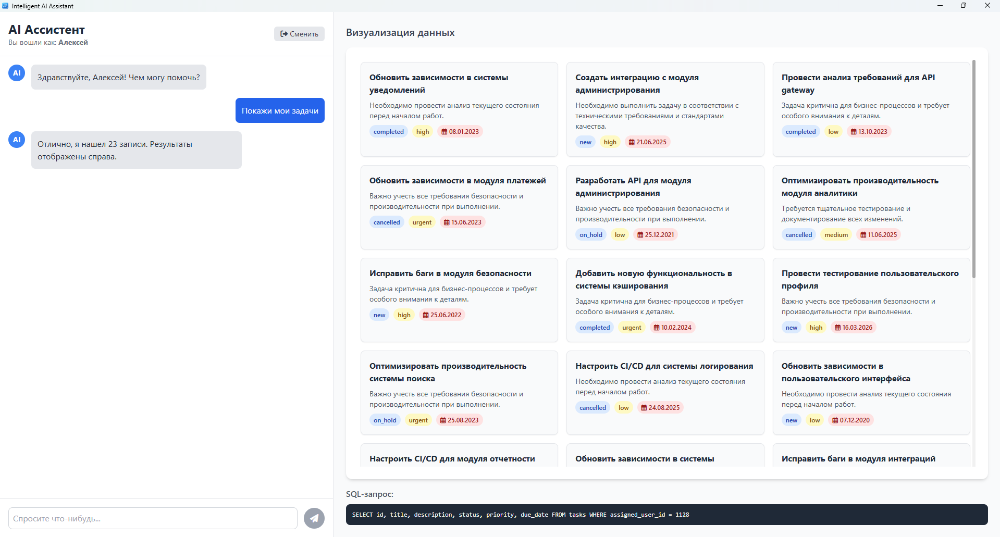
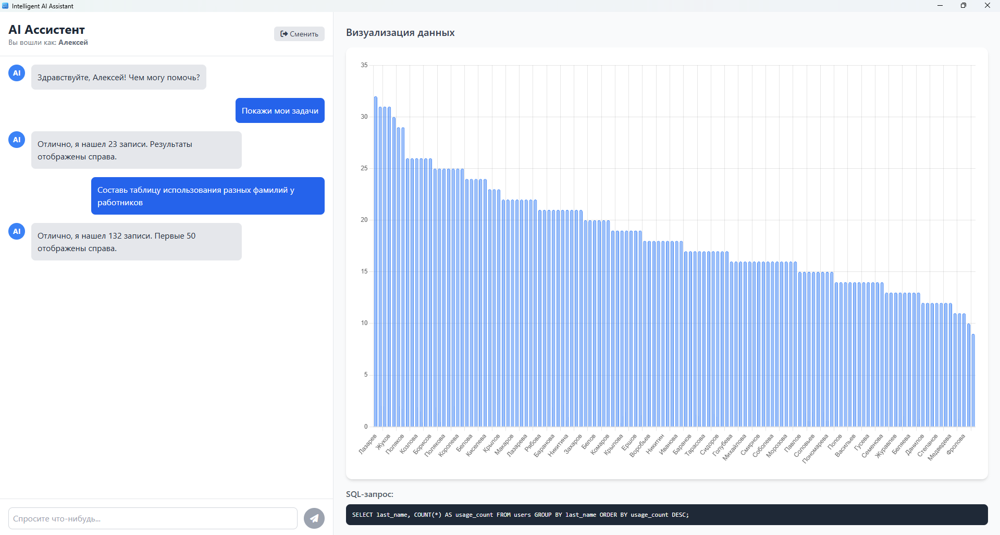

# AI Assistant — Десктопный ассистент для работы с БД

Это десктопное приложение на Electron JS, которое позволяет пользователям взаимодействовать с бд PostgreSQL на естественном языке. Приложение принимает запросы на русском языке, преобразует их в SQL-запросы с помощью Gemini API и динамически визуализирует полученные данные.

## 📸 Скриншоты

<table>
  <tr>
    <td align="center"><strong>Экран выбора пользователя</strong></td>
    <td align="center"><strong>Основной интерфейс (Таблица)</strong></td>
    <td align="center"><strong>Основной интерфейс (График)</strong></td>
  </tr>
  <tr>
    <td></td>
    <td></td>
    <td></td>
  </tr>
</table>

## ✨ Основные возможности

*   **Запросы на естественном языке:** Задавайте вопросы базе данных так, как если бы вы общались с человеком ("Покажи все мои задачи с высоким приоритетом").
*   **Аутентификация:** Выбор пользователя для выполнения персонализированных запросов ("мои задачи", "задачи моего отдела").
*   **Динамическая визуализация:** Результаты автоматически отображаются в наиболее подходящем формате:
    *   **KPI:** для запросов, возвращающих одно число.
    *   **Графики (Bar Chart):** для агрегированных данных (например, "посчитай задачи в каждом статусе").
    *   **Карточки:** для наглядного отображения задач с ключевой информацией.
    *   **Таблицы:** для всех остальных данных.
*   **Просмотр SQL:** Возможность увидеть SQL-запрос, который был сгенерирован LLM-моделью для вашего вопроса.
*   **Пагинация ("ленивая загрузка"):** Эффективная работа с большими объемами данных — отображение по 50 записей с кнопкой "Загрузить еще".
*   **Кросс-платформенность:** Приложение работает на Windows и macOS благодаря Electron (на линь было лень портировать :3).

## 🛠️ Технологический стек

*   **Десктопная оболочка:** [Electron](https://www.electronjs.org/)
*   **Фронтенд:** [Tailwind CSS](https://tailwindcss.com/)
*   **Визуализация:** [Chart.js](https://www.chartjs.org/)
*   **Бэкенд:** [FastAPI (Python)](https://fastapi.tiangolo.com/)
*   **База данных:** [PostgreSQL](https://www.postgresql.org/)
*   **Языковая модель:** [Google Gemini](https://ai.google.dev/)
*   **Инструменты сборки:** [Node.js](https://nodejs.org/), [npm](https://www.npmjs.com/), [Electron Builder](https://www.electron.build/)

## 📦 Сборка приложения

Если вы хотите создать установочный файл (`.exe` для Windows или `.dmg` для macOS), используйте следующие команды:

*   **Для Windows:**
    ```bash
    npm run dist:win
    ```

*   **Для macOS:**
    ```bash
    npm run dist:mac
    ```

Готовые файлы появятся в папке `dist`.
